# AWS Serverless URL Shortener with Usage Analytics

<p align="center">
  
  
  
  
  
  
  
  
  
  
  
  
  
</p>

<p align="center">
  <b>A cloud-native, fully serverless URL shortening platform built on Amazon Web Services</b>
</p>

<p align="center">
  <a href="#project-overview">Overview</a> •
  <a href="#key-features">Features</a> •
  <a href="#system-architecture">Architecture</a> •
  <a href="#deployment">Deployment</a> •
  <a href="#screenshots">Screenshots</a> •
  <a href="#technology-stack">Tech Stack</a>
</p>

---

## 📋 Table of Contents

- [Project Overview](#project-overview)
- [Key Features](#key-features)
- [System Architecture](#system-architecture)
- [Architecture Workflow](#architecture-workflow)
- [AWS Services Used](#aws-services-used)
- [Project Structure](#project-structure)
- [Technology Stack](#technology-stack)
- [Prerequisites](#prerequisites)
- [Deployment](#deployment)
- [Screenshots](#screenshots)
- [Cost Management Notice](#cost-management-notice)
- [Future Enhancements](#future-enhancements)
- [Team](#team)
- [License](#license)
- [Acknowledgement](#acknowledgement)

---

## 🚀 Project Overview

The **AWS Serverless URL Shortener** is a cloud-native web application designed to demonstrate the implementation of a scalable, secure, and cost-efficient serverless architecture using **Amazon Web Services (AWS)**.

The platform enables authenticated users to generate shortened URLs, seamlessly redirect users to the original destination, and collect click analytics through an event-driven processing pipeline.

The solution is built using AWS Lambda for serverless compute, Amazon API Gateway for RESTful API management, Amazon Cognito for user authentication, Amazon DynamoDB for URL storage, Amazon S3 and Amazon CloudFront for frontend hosting and content delivery, Amazon SQS for asynchronous event processing, Amazon Athena for analytical querying, and Amazon CloudWatch for monitoring and operational insights.

By leveraging fully managed AWS services, the application achieves automatic scalability, high availability, enhanced security, and reduced operational overhead while eliminating the need to provision or maintain servers. The project demonstrates modern serverless application development, infrastructure automation using AWS SAM, and cloud-native design principles aligned with industry best practices.

---

## ✨ Key Features

- **Secure User Authentication** using Amazon Cognito.
- **URL Shortening** with automatic generation of unique short URLs.
- **Instant URL Redirection** to the original destination using serverless APIs.
- **Event-Driven Click Analytics** powered by Amazon SQS and AWS Lambda.
- **Persistent URL Storage** using Amazon DynamoDB.
- **Serverless Backend** built with AWS Lambda and Amazon API Gateway.
- **Static React Frontend Hosting** using Amazon S3 and Amazon CloudFront.
- **Global Content Delivery** through Amazon CloudFront for low-latency access.
- **Infrastructure as Code (IaC)** using AWS SAM and AWS CloudFormation.
- **SQL-Based Analytics** using Amazon Athena.
- **Application Monitoring and Logging** using Amazon CloudWatch.
- **Distributed Request Tracing** using AWS X-Ray.
- **Automatic Scalability and High Availability** through fully managed AWS services.
- **Cost-Optimized Serverless Architecture** with minimal operational overhead.

---

## 🏗️ System Architecture

<p align="center">
  
</p>

The application follows a **fully serverless event-driven architecture** deployed entirely on AWS. The architecture is designed for high availability, automatic scaling, and minimal operational overhead.

### Architecture Components

- **React Frontend** — Modern single-page application
- **Amazon S3** — Static website hosting for frontend assets
- **Amazon CloudFront** — Global content delivery network
- **Amazon Cognito** — User authentication and authorization
- **Amazon API Gateway** — RESTful API endpoints
- **AWS Lambda** — Serverless compute for business logic
- **Amazon DynamoDB** — NoSQL database for URL storage
- **Amazon SQS** — Message queue for click analytics events
- **Amazon Athena** — Serverless SQL query engine
- **Amazon CloudWatch** — Monitoring and observability
- **AWS X-Ray** — Distributed tracing

---

## 🔄 Architecture Workflow

The AWS Serverless URL Shortener follows a cloud-native, event-driven architecture built entirely on managed AWS services. The complete workflow is described below:

### 1. User Access

The user accesses the React-based web application, which is hosted on **Amazon S3** and globally distributed through **Amazon CloudFront** for improved performance and reduced latency.

### 2. User Authentication

Users securely register and log in using **Amazon Cognito**. After successful authentication, Cognito issues a JSON Web Token (JWT), which is used to authorize subsequent API requests.

### 3. URL Shortening

Authenticated users submit a long URL through the frontend. The request is routed via **Amazon API Gateway** to an **AWS Lambda** function, which validates the input, generates a unique short code, and stores the URL mapping in **Amazon DynamoDB**.

### 4. Short URL Generation

The Lambda function returns the generated short URL to the frontend, allowing users to copy and share the shortened link instantly.

### 5. URL Redirection

When a shortened URL is accessed, the request is processed by **Amazon API Gateway**, which invokes the Redirect Lambda function. The function retrieves the corresponding original URL from **Amazon DynamoDB** and redirects the user using an HTTP 302 response.

### 6. Event-Driven Analytics

During every successful redirection, the Redirect Lambda asynchronously publishes a click event to **Amazon SQS**. An Analytics Lambda function consumes these events, processes the click information, and stores analytics data in **Amazon S3** for further analysis.

### 7. Analytics and Monitoring

The stored analytics data can be queried using **Amazon Athena**, while operational metrics, application logs, performance statistics, and system health are monitored through **Amazon CloudWatch** and **AWS X-Ray**.

### 8. Infrastructure Management

The complete cloud infrastructure is provisioned and managed using **AWS SAM** and **AWS CloudFormation**, enabling automated deployment, reproducibility, and simplified infrastructure management.

---

## ☁️ AWS Services Used

| Service | Purpose |
|---------|---------|
| **Amazon API Gateway** | REST API endpoints for frontend communication |
| **AWS Lambda** | Serverless compute for URL shortening, redirection, and analytics |
| **Amazon DynamoDB** | NoSQL database for URL mappings and metadata |
| **Amazon Cognito** | User authentication, registration, and JWT token management |
| **Amazon S3** | Static website hosting and analytics data lake |
| **Amazon CloudFront** | Global CDN for low-latency content delivery |
| **Amazon SQS** | Message queue for decoupled click analytics |
| **Amazon Athena** | Serverless SQL analytics over S3 data |
| **Amazon CloudWatch** | Logs, metrics, alarms, and dashboards |
| **AWS X-Ray** | Distributed tracing and service maps |
| **AWS SAM** | Infrastructure as Code and deployment automation |

---

## 📁 Project Structure

```text
AWS-Serverless-URL-Shortener/
│
├── analytics/                 # Analytics Lambda Function
│   ├── app.py
│   └── requirements.txt
│
├── hello_world/               # URL Shortening Lambda Function
│   ├── app.py
│   └── requirements.txt
│
├── redirect/                  # URL Redirection Lambda Function
│   ├── app.py
│   └── requirements.txt
│
├── url-shortener-frontend/    # React Frontend Application
│   ├── public/
│   ├── src/
│   ├── package.json
│   └── package-lock.json
│
├── events/                    # Sample API events
│
├── template.yaml              # AWS SAM Infrastructure Template
├── samconfig.toml             # SAM Deployment Configuration
├── README.md                  # Project Documentation
└── .gitignore                 # Git Ignore Rules
```

- **analytics/** — Used to process click events received from Amazon SQS and store analytics data in Amazon S3 for reporting and analysis.
- **hello_world/** — Used to implement the URL shortening service by validating user input, generating unique short codes, and storing URL mappings in Amazon DynamoDB.
- **redirect/** — Used to retrieve the original URL associated with a short code, update click statistics, and redirect users to the destination website.
- **url-shortener-frontend/** — Used to host the React-based frontend application, providing the user interface for authentication, URL shortening, and URL management.
- **events/** — Used to store sample event payloads for local testing and debugging of AWS Lambda functions.
- **template.yaml** — Used to define the complete serverless infrastructure, including AWS Lambda, API Gateway, DynamoDB, SQS, IAM policies, and other AWS resources using AWS SAM.
- **samconfig.toml** — Used to store AWS SAM deployment configurations, simplifying the build and deployment process.
- **README.md** — Used to provide project documentation, including the architecture, setup instructions, deployment steps, and usage guidelines.
- **.gitignore** — Used to specify files and directories that should be excluded from version control to maintain a clean repository.

---

## 🔄 Workflow

1. **User Authentication** — Users securely register and log in through **Amazon Cognito**, which authenticates requests using JWT tokens.

2. **URL Shortening** — Authenticated users submit a long URL via the React frontend. The request is routed through **Amazon API Gateway** to an **AWS Lambda** function, which validates the URL, generates a unique short code, and stores the mapping in **Amazon DynamoDB**.

3. **Short URL Generation** — The generated short URL is returned to the frontend, allowing users to copy and share it instantly.

4. **URL Redirection** — When a shortened URL is accessed, **API Gateway** invokes the Redirect Lambda function, which retrieves the original URL from **Amazon DynamoDB** and redirects the user using an HTTP 302 response.

5. **Click Analytics Processing** — During every successful redirection, the Redirect Lambda publishes a click event to **Amazon SQS**. The Analytics Lambda processes these events asynchronously and stores analytics data in **Amazon S3**.

6. **Analytics and Monitoring** — Analytics data stored in Amazon S3 can be queried using **Amazon Athena**, while **Amazon CloudWatch** and **AWS X-Ray** provide application monitoring, logging, and performance insights.

7. **Infrastructure Deployment** — The complete serverless infrastructure is provisioned and managed using **AWS SAM** and **AWS CloudFormation**, enabling automated deployment and simplified infrastructure management.

---

## 🛠️ Technology Stack

### Frontend

- React
- HTML5
- CSS3
- JavaScript

### Backend

- Python
- AWS Lambda
- REST APIs

### Database

- Amazon DynamoDB

### Cloud

- Amazon API Gateway
- AWS Lambda
- Amazon DynamoDB
- Amazon S3
- Amazon CloudFront
- Amazon Cognito
- Amazon SQS
- Amazon Athena
- Amazon CloudWatch
- AWS X-Ray
- AWS SAM (Infrastructure as Code)
- Amazon CloudWatch Dashboard: Amazon CloudWatch Dashboard provides real-time visualization of application metrics including Lambda invocations, execution duration, API request count, latency, backend processing time, and error rates. It serves as the operational monitoring dashboard for the serverless application.

---

## 📋 Prerequisites

Before deploying this project, ensure you have the following installed and configured:

- AWS CLI configured with valid credentials
- AWS SAM CLI installed
- Python 3.x
- Node.js and npm
- Git

---

## 🚀 Deployment

The application is deployed using **AWS Serverless Application Model (AWS SAM)** and follows a fully serverless deployment workflow.

### Clone the Repository

```bash
git clone <repository-url>
cd AWS-Serverless-URL-Shortener
```

### Build the Serverless Application

```bash
sam build
```

### Deploy to AWS

For the first deployment:

```bash
sam deploy --guided
```

For subsequent deployments:

```bash
sam deploy
```

### Frontend Deployment

Navigate to the frontend directory:

```bash
cd url-shortener-frontend
```

Install dependencies:

```bash
npm install
```

Build the React application:

```bash
npm run build
```

Upload the production build to the S3 bucket:

```bash
aws s3 sync build/ s3://<your-s3-bucket-name> --delete
```

Invalidate the CloudFront cache:

```bash
aws cloudfront create-invalidation   --distribution-id <your-distribution-id>   --paths "/*"
```

### Verify Deployment

- Open the CloudFront URL.
- Register or log in using Amazon Cognito.
- Generate a shortened URL.
- Verify URL redirection.
- Confirm analytics are processed through Amazon SQS and AWS Lambda.
- Monitor logs and metrics using Amazon CloudWatch.

---

## 📸 Screenshots

### System Architecture Diagram

<p align="center">
  
</p>

---

### Figure 1. User Authentication Interface

<p align="center">
  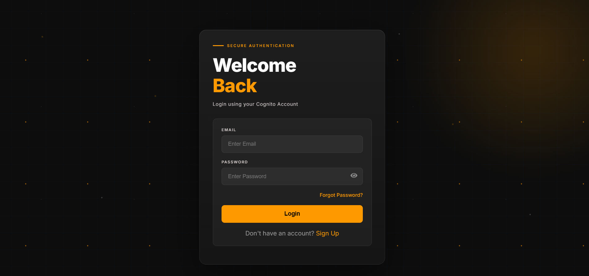
</p>

The React-based login interface secured using Amazon Cognito enables authenticated access to the URL shortening platform through JWT-based user authentication.

---

### Figure 2. URL Shortening Dashboard

<p align="center">
  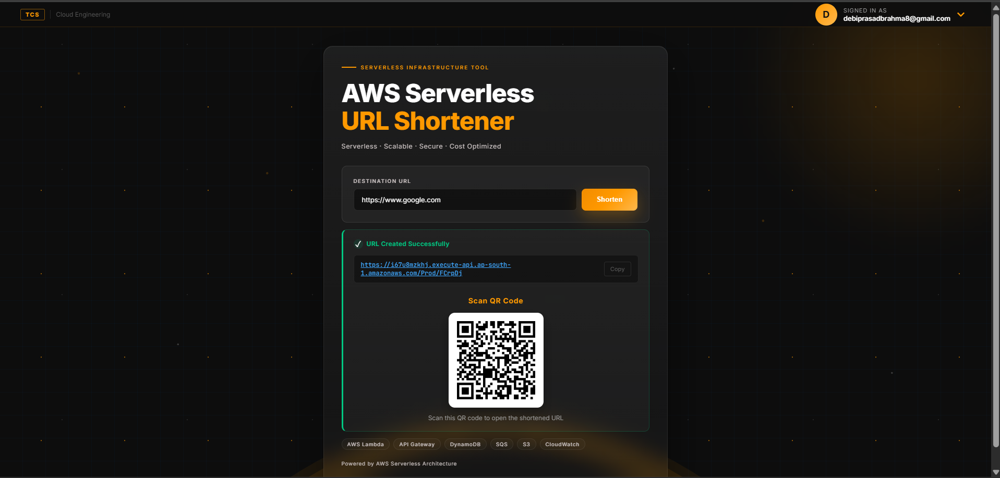
</p>

Authenticated users can submit long URLs to generate unique shortened links. The application also displays the generated URL and corresponding QR code for convenient sharing.

---

### Figure 3. AWS Lambda Functions

<p align="center">
  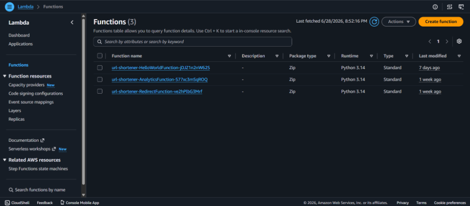
</p>

AWS Lambda functions implement the core serverless backend, including URL shortening, URL redirection, and click analytics processing without requiring server management.

---

### Amazon API Gateway

<p align="center">
  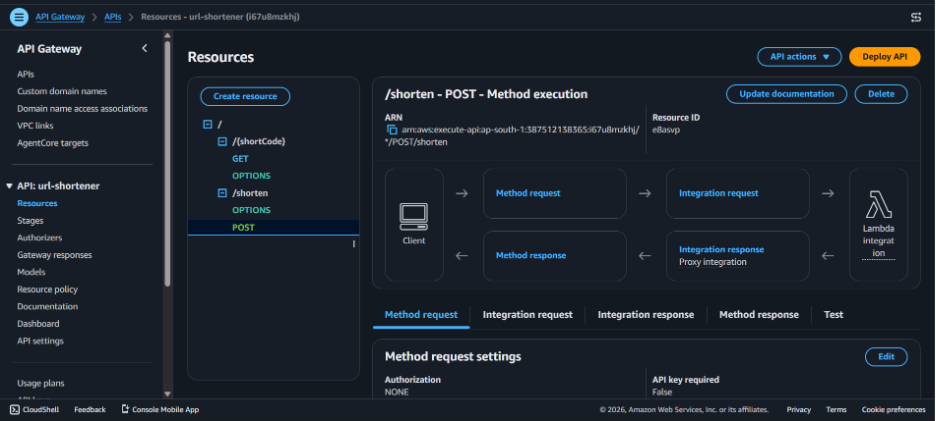
</p>

<p align="center">
  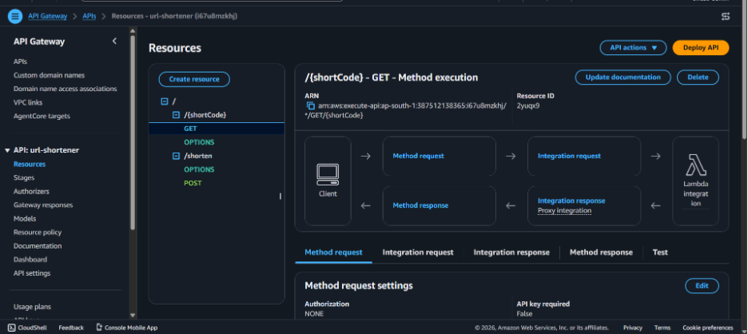
</p>

Amazon API Gateway exposes secure REST endpoints that route client requests to the appropriate AWS Lambda functions for URL shortening and redirection.

---

### Figure 5. Amazon DynamoDB Table

<p align="center">
  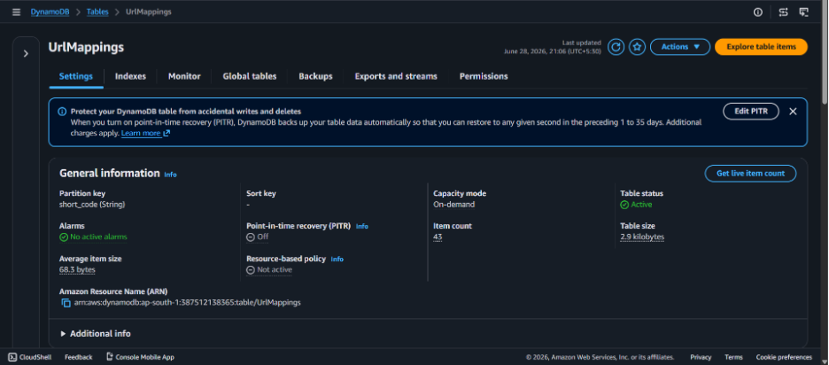
</p>

Amazon DynamoDB stores URL mappings, including generated short codes, original URLs, and click statistics using a fully managed NoSQL database.

---

### Amazon DynamoDB (Additional Views)

<p align="center">
  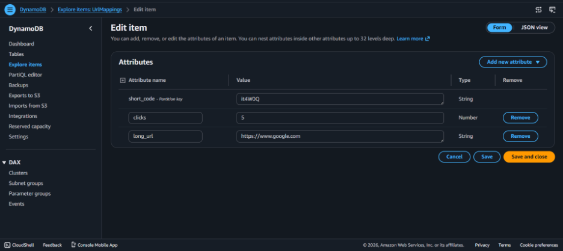
</p>

<p align="center">
  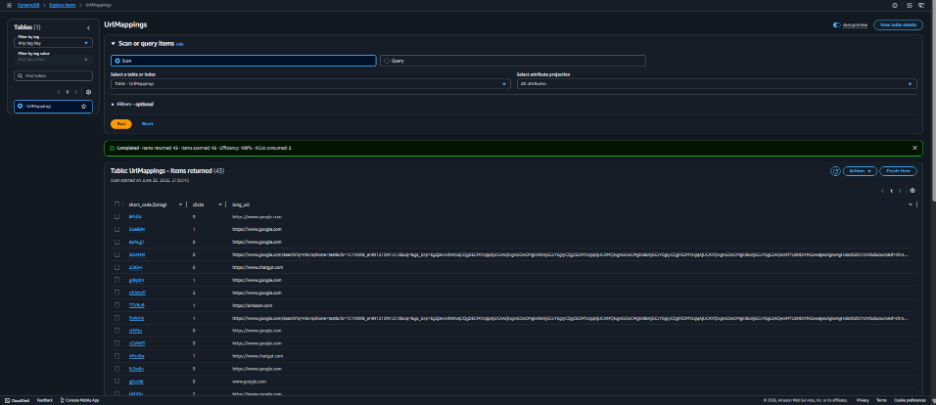
</p>

<p align="center">
  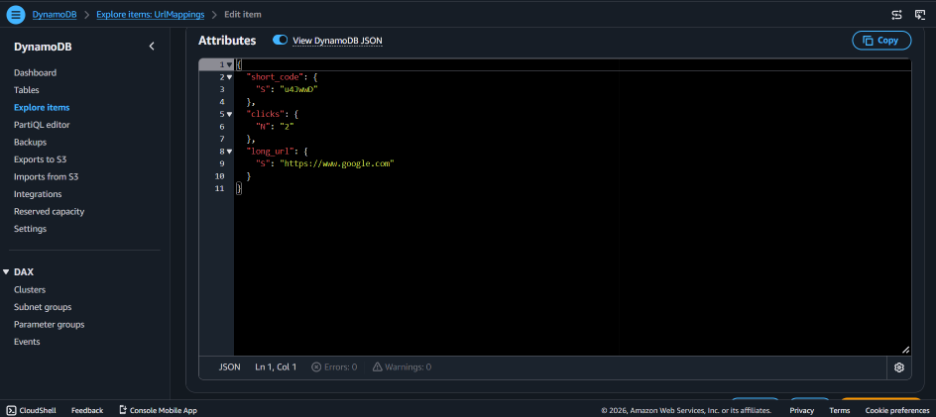
</p>

---

### Amazon SQS

<p align="center">
  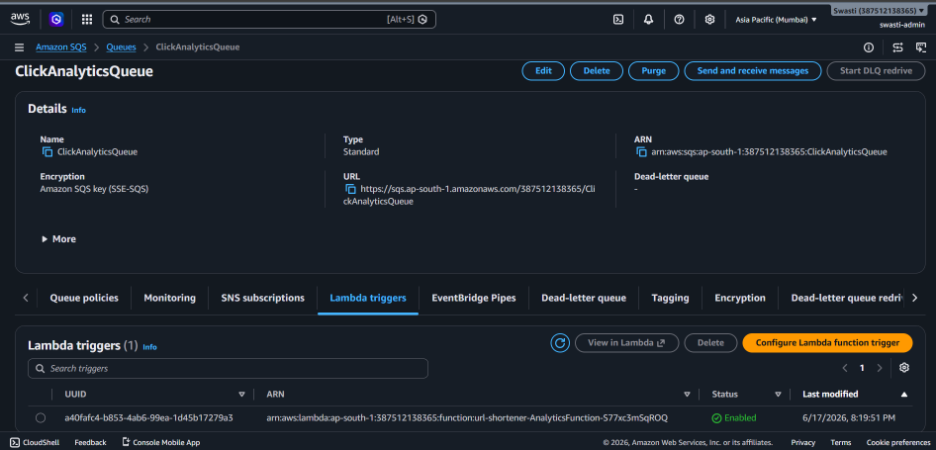
</p>

<p align="center">
  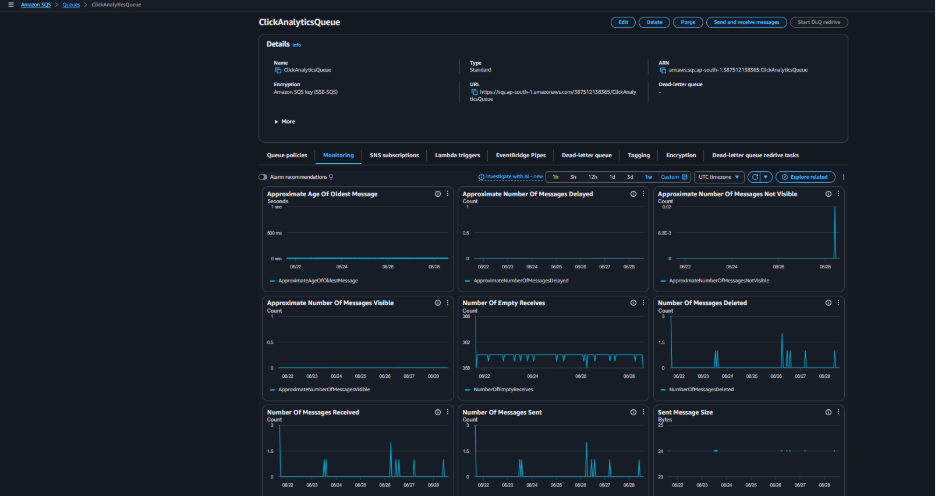
</p>

---

### Amazon S3

<p align="center">
  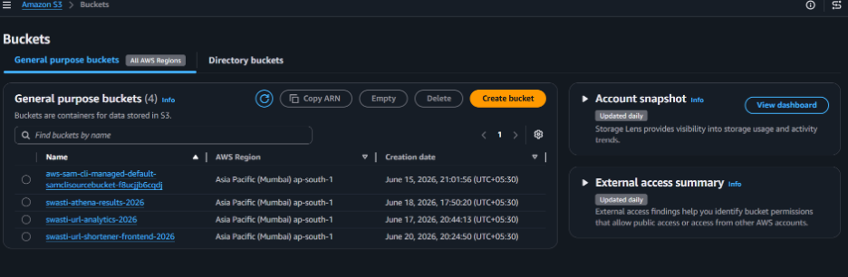
</p>

<p align="center">
  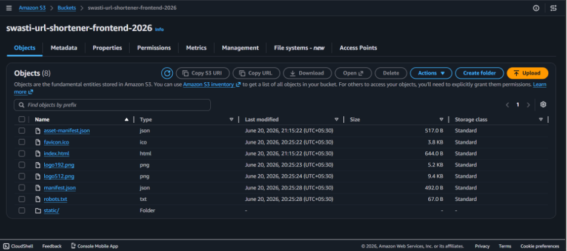
</p>

<p align="center">
  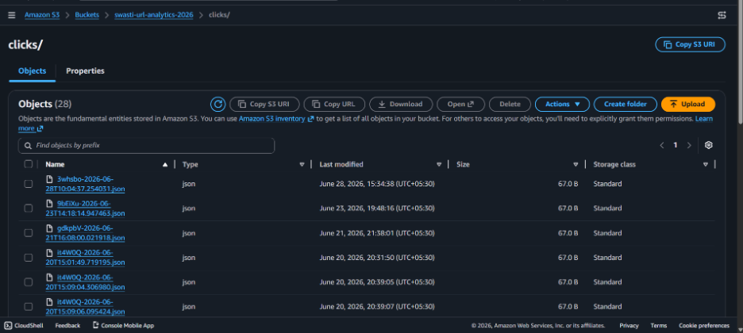
</p>

<p align="center">
  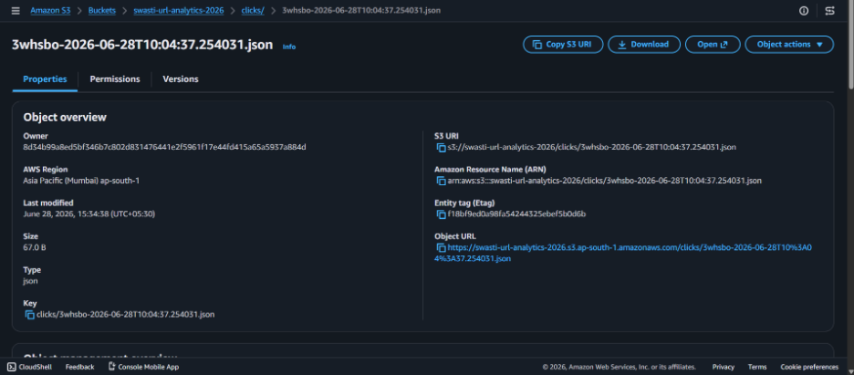
</p>

---

### Amazon Athena

<p align="center">
  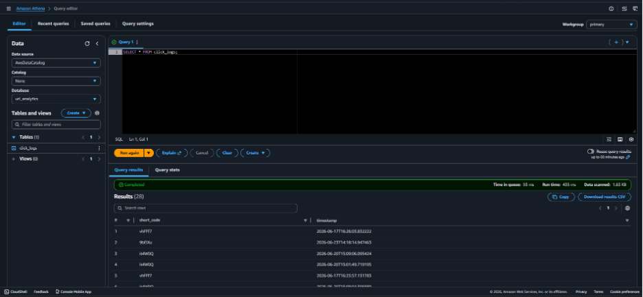
</p>

<p align="center">
  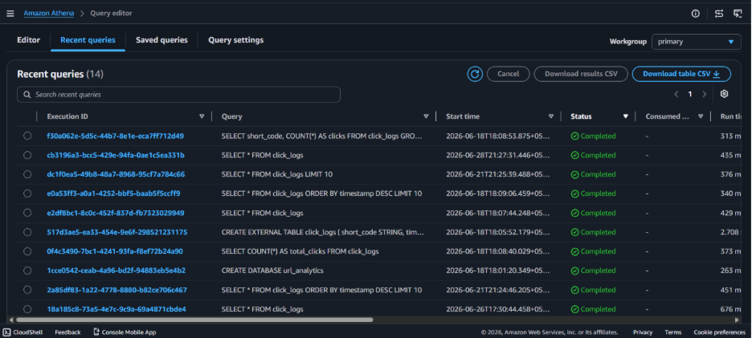
</p>

---

### Amazon Cognito

<p align="center">
  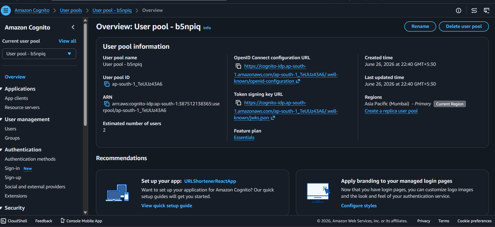
</p>

---

### Amazon CloudFront

<p align="center">
  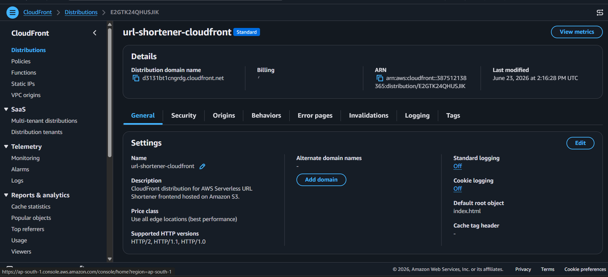
</p>

---

### Amazon CloudWatch

<p align="center">
  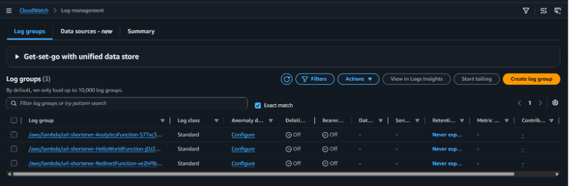
</p>

<p align="center">
  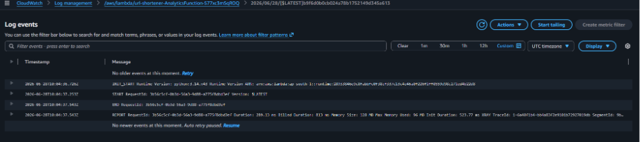
</p>

<p align="center">
  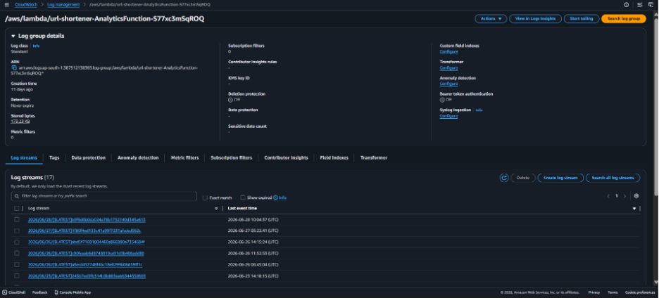
</p>

---

### AWS X-Ray

<p align="center">
  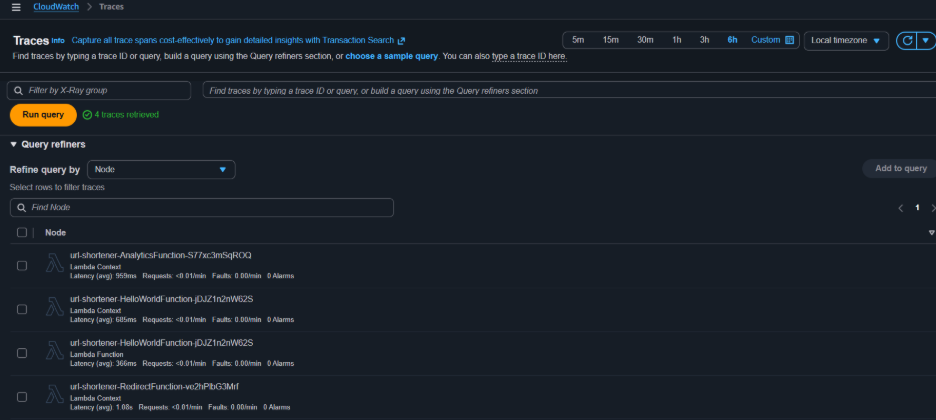
</p>

<p align="center">
  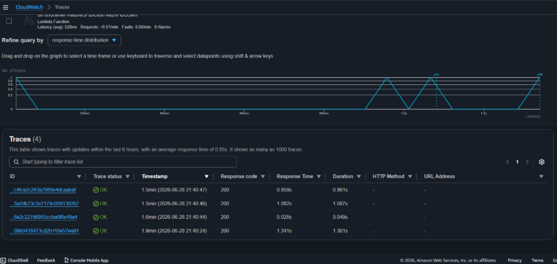
</p>

<p align="center">
  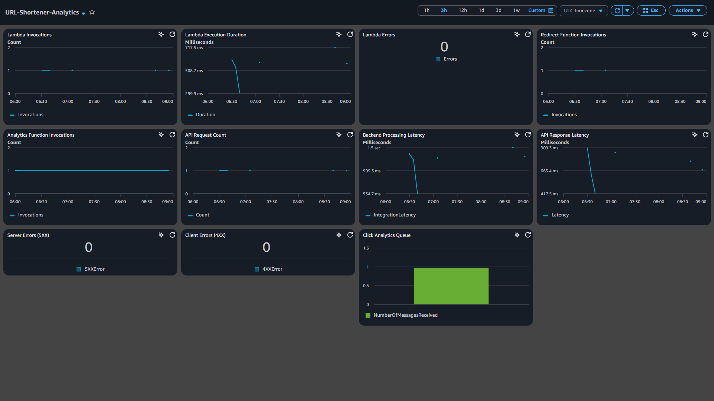
</p>

---

### CloudWatch Dashboard (instead of QuickSight)

<p align="center">
  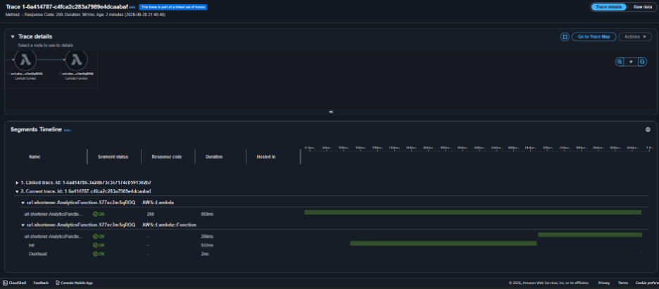
</p>

Amazon CloudWatch Dashboard provides real-time visualization of application metrics including Lambda invocations, execution duration, API request count, latency, backend processing time, and error rates. It serves as the operational monitoring dashboard for the serverless application.

---

## 💰 Cost Management Notice

> ⚠️ **Important:** This project uses AWS cloud services. Some AWS resources may incur charges beyond the AWS Free Tier depending on usage.
>
> After project evaluation, the following resources can be disabled or deleted to avoid unnecessary costs:
>
> - Amazon CloudFront Distribution (optional)
> - Amazon API Gateway
> - AWS Lambda Functions
> - Amazon DynamoDB Tables
> - Amazon SQS Queue
> - Amazon S3 Buckets
> - Amazon Cognito User Pool (optional)
> - Amazon CloudWatch Logs and Dashboards
> - AWS X-Ray Traces
>
> The entire infrastructure can be recreated at any time using the provided AWS SAM template.

---

## 🔮 Future Enhancements

- Amazon Route 53 Hosted Zone
- QR Code generation for shortened URLs
- URL expiration based on date or usage limits
- Custom short URLs
- QuickSight Dashboard
- Advanced analytics and reporting
- Mobile application
- Multi-region deployment for improved availability and fault tolerance

---

## 👥 Team

- Swastisikha Pradhan
- Debiprasad Brahma
- Nirmalya Kumar Mohanty
- Sai Shruti Barik
- Pedenti Nanda Kishore
- Sumit Kumar Mishra

---

## 📄 License

This project was developed as part of the **TCS Capstone Project** for educational purposes.

---

## 🙏 Acknowledgement

This project was developed as part of the **TCS Capstone Program** to demonstrate the design and implementation of a scalable, cloud-native serverless application using Amazon Web Services (AWS). It showcases modern serverless architecture through event-driven processing, Infrastructure as Code (AWS SAM), secure authentication, distributed analytics, monitoring, logging, and global content delivery while following cloud-native design principles and industry best practices.

---

<p align="center">
  <b>Built with ❤️ on AWS Serverless</b>
</p>

<p align="center">
  <a href="#aws-serverless-url-shortener-with-usage-analytics">⬆ Back to Top</a>
</p>
